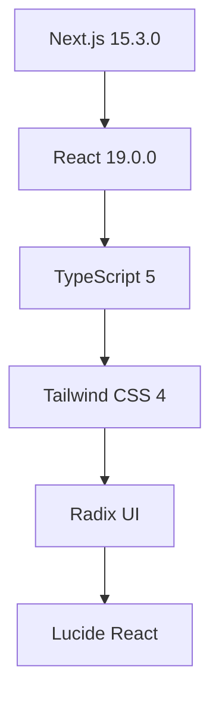

<div align="center">

# 💰 Findly - Control de Finanzas Personales

### Una aplicación web moderna y completa para gestionar tus finanzas personales de manera inteligente

[](https://nextjs.org/)
[](https://reactjs.org/)
[](https://www.typescriptlang.org/)
[](https://tailwindcss.com/)

[](https://developer.mozilla.org/en-US/docs/Web/Progressive_web_apps)
[](https://web.dev/progressive-web-apps/)
[](https://opensource.org/licenses/MIT)

</div>

---

## 🎯 ¿Qué es Findly?

**Findly** es una aplicación web moderna diseñada para ayudarte a tomar el control total de tus finanzas personales. Con una interfaz intuitiva y funcionalidades avanzadas, te permite gestionar gastos, ingresos, tarjetas de crédito, cuotas y deudas de manera eficiente.

### ✨ Características Destacadas

- 📱 **100% Responsive** - Funciona perfectamente en móviles, tablets y desktop
- 🎨 **UI Moderna** - Interfaz elegante con animaciones suaves
- ⚡ **Rápida** - Construida con Next.js 15 y optimizada para performance
- 🔒 **Privada** - Tus datos se mantienen en tu dispositivo
- 🎯 **Intuitiva** - Fácil de usar, sin curva de aprendizaje

---

## 🚀 Funcionalidades Principales

### 💳 Gestión Completa de Finanzas

| Módulo | Descripción | Características |
|--------|-------------|-----------------|
| **💰 Gastos** | Registro y categorización | Múltiples medios de pago, cuotas, filtros avanzados |
| **💵 Ingresos** | Control de entradas | Diferentes fuentes, seguimiento temporal |
| **💳 Tarjetas** | Gestión de crédito | Límites, saldos, fechas de cierre/vencimiento |
| **📊 Cuotas** | Seguimiento de pagos | Estado pendiente/pagado, vencimientos |
| **📋 Deudas** | Control de obligaciones | Por pagar/cobrar, fechas de vencimiento |
| **🏷️ Categorías** | Organización inteligente | Emojis, personalización completa |

### 📈 Dashboard Inteligente

- **Métricas en tiempo real** - Balance, gastos, ingresos actualizados al instante
- **Filtros flexibles** - Por mes, año o período completo
- **Estadísticas visuales** - Colores diferenciados para mejor comprensión
- **Cuotas separadas** - Pendientes y pagadas claramente diferenciadas

### 🎨 Experiencia de Usuario

- **Navegación fluida** - Menú hamburguesa en móviles, navegación horizontal en desktop
- **Botón flotante** - Acceso rápido para agregar gastos desde cualquier página
- **Animaciones suaves** - Transiciones elegantes y feedback visual
- **Modo oscuro** - Soporte completo para temas claros y oscuros

---

## 🛠️ Stack Tecnológico

### Frontend Moderno


### Herramientas de Desarrollo
- **⚡ Turbopack** - Bundler ultra-rápido para desarrollo
- **🔍 ESLint** - Linting de código para calidad
- **🎨 PostCSS** - Procesamiento avanzado de CSS
- **📦 npm** - Gestión de dependencias

### Arquitectura
- **🏗️ App Router** - Enrutamiento moderno de Next.js
- **🌐 Context API** - Estado global eficiente
- **💾 localStorage** - Persistencia local de datos
- **🎯 TypeScript** - Tipado estático para robustez

---

## 📱 Capturas de Pantalla

<div align="center">

### 🏠 Dashboard Principal


### 📱 Vista Móvil


### 💳 Gestión de Gastos


</div>

---

## 🚀 Instalación Rápida

### Prerrequisitos
- **Node.js** 18+ 
- **npm** o **yarn**

### ⚡ Instalación en 3 pasos

```bash
# 1. Clonar el repositorio
git clone https://github.com/tu-usuario/findly.git
cd findly

# 2. Instalar dependencias
npm install

# 3. Ejecutar en desarrollo
npm run dev
```

### 🌐 Acceso
Abre tu navegador en: **http://localhost:3000**

### 📜 Scripts Disponibles

```bash
npm run dev          # 🚀 Desarrollo con Turbopack
npm run build        # 🏗️ Construcción para producción
npm run start        # 🌐 Servidor de producción
npm run lint         # 🔍 Verificación de código
```

---

## 📖 Guía de Uso

### 🏠 Dashboard - Tu Centro de Control

El dashboard es tu ventana principal a las finanzas:

#### 📊 Paneles de Información
- **💰 Gastos**: Total del período seleccionado
- **💵 Ingresos**: Entradas de dinero
- **⚖️ Balance**: Superávit o déficit
- **📅 Cuotas Pendientes**: Por pagar
- **✅ Cuotas Pagadas**: Ya saldadas

#### 🎛️ Filtros Inteligentes
- **📅 Mes**: Enero a Diciembre o "Año completo"
- **📆 Año**: Años disponibles (actual + 4 futuros)

### 💳 Gestión de Tarjetas

#### ➕ Agregar Nueva Tarjeta
1. Ve a **"Tarjetas"**
2. Haz clic en **"Agregar Tarjeta"**
3. Completa:
   - **🏷️ Nombre**: Ej: "Visa Gold"
   - **🏦 Banco**: Ej: "Banco Nación"
   - **💳 Límite**: Ej: $150,000
   - **📅 Día de Cierre**: Ej: 15
   - **⏰ Día de Vencimiento**: Ej: 25

#### 🎯 Tarjetas de Ejemplo
- **Visa Gold** (Banco Nación) - $150,000
- **Mastercard Platinum** (Banco Ciudad) - $200,000

### 📝 Registro de Gastos

#### ➕ Agregar Gasto Rápido
1. **Botón flotante** (+) en cualquier página
2. O ve a **"Gastos"** → **"Agregar Gasto"**
3. Completa los campos:
   - **📝 Descripción**: Concepto del gasto
   - **💰 Monto**: Cantidad
   - **🏷️ Categoría**: Selecciona una
   - **📅 Fecha**: Cuándo ocurrió
   - **💳 Medio de Pago**: Efectivo, Débito, Crédito, etc.
   - **💳 Tarjeta**: (Solo crédito/débito)
   - **📊 Cuotas**: (Solo crédito)

#### 🏷️ Categorías Predefinidas
- 🍽️ **Alimentación**
- 🚗 **Transporte**
- 🏠 **Vivienda**
- 💡 **Servicios**
- 🎮 **Entretenimiento**
- 💊 **Salud**
- 📚 **Educación**
- 👕 **Ropa**
- 📦 **Otros**

### 💰 Registro de Ingresos

#### ➕ Agregar Ingreso
1. Ve a **"Ingresos"**
2. Completa:
   - **📝 Descripción**: Concepto
   - **💰 Monto**: Cantidad
   - **📊 Fuente**: Salario, Freelance, Inversiones, etc.

### 💳 Gestión de Cuotas

#### 👀 Ver Cuotas
1. Ve a **"Cuotas"**
2. Usa las pestañas:
   - **⏳ Cuotas Pendientes**: Por pagar
   - **✅ Cuotas Pagadas**: Ya saldadas

#### ✅ Marcar como Pagada
1. En **"Cuotas Pendientes"**
2. Haz clic en **"Marcar como Pagada"**
3. Se mueve automáticamente a **"Cuotas Pagadas"**

### 📋 Gestión de Deudas

#### 📊 Tipos de Deudas
- **💸 Por Pagar**: Dinero que debes
- **💰 Por Cobrar**: Dinero que te deben

#### ➕ Agregar Deuda
1. Ve a **"Deudas"**
2. Completa:
   - **📝 Descripción**: Concepto
   - **💰 Monto**: Cantidad
   - **📊 Tipo**: Por pagar/cobrar
   - **👤 Persona**: Con quién
   - **📅 Fecha**: Cuándo
   - **⏰ Vencimiento**: (Opcional)
   - **📝 Notas**: Información extra

---

## 🏗️ Arquitectura del Proyecto

### 📁 Estructura de Carpetas

```
finly/
├── 📁 src/
│   ├── 📁 app/                    # App Router de Next.js
│   │   ├── 📁 context/            # Estado global
│   │   │   ├── CategoriasContext.tsx
│   │   │   ├── TarjetasContext.tsx
│   │   │   └── GastoModalContext.tsx
│   │   ├── 📁 types/              # Definiciones TypeScript
│   │   │   └── types.ts
│   │   ├── 📁 categorias/         # Gestión de categorías
│   │   ├── 📁 cuotas/             # Gestión de cuotas
│   │   ├── 📁 deudas/             # Gestión de deudas
│   │   ├── 📁 gastos/             # Gestión de gastos
│   │   ├── 📁 ingresos/           # Gestión de ingresos
│   │   ├── 📁 tarjetas/           # Gestión de tarjetas
│   │   ├── layout.tsx             # Layout principal
│   │   └── page.tsx               # Dashboard
│   ├── 📁 components/             # Componentes reutilizables
│   │   ├── 📁 ui/                 # Componentes base
│   │   │   ├── button.tsx
│   │   │   ├── card.tsx
│   │   │   ├── dialog.tsx
│   │   │   ├── floating-action-button.tsx
│   │   │   ├── nav.tsx
│   │   │   └── ...
│   │   ├── GastoModal.tsx         # Modal de gastos
│   │   └── nav.tsx                # Navegación
│   └── 📁 lib/                    # Utilidades
│       ├── config.ts              # Configuración
│       ├── utils.ts               # Funciones helper
│       └── validations.ts         # Validaciones
├── 📁 public/                     # Archivos estáticos
├── package.json                   # Dependencias
├── tsconfig.json                  # Config TypeScript
├── tailwind.config.js             # Config Tailwind
└── next.config.ts                 # Config Next.js
```

### 🔧 Patrones de Diseño

#### Component-Based Architecture
```typescript
// Componente reutilizable
interface ButtonProps {
  variant: 'default' | 'outline' | 'ghost'
  size: 'sm' | 'md' | 'lg'
  children: React.ReactNode
}
```

#### Context API para Estado Global
```typescript
// Context para categorías
const CategoriasContext = createContext<CategoriasContextType>()

// Context para tarjetas
const TarjetasContext = createContext<TarjetasContextType>()

// Context para modal de gastos
const GastoModalContext = createContext<GastoModalContextType>()
```

#### Custom Hooks
```typescript
// Hook para toast notifications
const { toast, showToast, hideToast } = useToast()

// Hook para modal de gastos
const { isModalOpen, openModal, closeModal } = useGastoModal()
```

### 📊 Tipos de Datos

```typescript
// Gasto con cuotas
interface Gasto {
  id: number
  descripcion: string
  monto: number
  categoriaId: number
  medioPago: MedioPago
  fecha: string
  cuotas?: number
  cuotasPagadas?: number
  tarjetaId?: number
  estado?: 'pendiente' | 'pagada'
}

// Tarjeta de crédito
interface Tarjeta {
  id: number
  nombre: string
  banco: string
  limite: number
  diaCierre: number
  diaVencimiento: number
  saldoUsado: number
  saldoDisponible: number
}

// Categoría personalizable
interface Categoria {
  id: number
  nombre: string
  emoji: string
  color?: string
}
```

---

## 🎨 Características de UX/UI

### 📱 Diseño Responsive

#### Breakpoints Optimizados
- **📱 Móvil**: < 640px - Cards y navegación vertical
- **📱 Tablet**: 640px - 1024px - Layout híbrido
- **💻 Desktop**: > 1024px - Tablas y navegación horizontal

#### Navegación Adaptativa
- **📱 Móvil**: Menú hamburguesa con animaciones
- **💻 Desktop**: Navegación horizontal con indicadores

### 🎭 Animaciones y Transiciones

#### Menú Móvil
- **Entrada**: Slide desde la derecha con curva bezier
- **Salida**: Slide hacia la derecha con timing optimizado
- **Enlaces**: Aparecen escalonadamente con delays

#### Botón Flotante
- **Flotación**: Movimiento sutil perpetuo
- **Hover**: Escalado y rotación del ícono
- **Click**: Efecto ripple circular

### 🎨 Sistema de Colores

#### Paleta Principal
- **Primary**: Negro/Escala de grises
- **Success**: Verde para pagos/ingresos
- **Warning**: Amarillo para cuotas pendientes
- **Error**: Rojo para gastos/deudas

#### Modo Oscuro
- Soporte completo para temas claros y oscuros
- Transiciones suaves entre modos

---

## ⚡ Optimizaciones de Performance

### 🚀 Rendimiento Frontend

#### React Optimizations
```typescript
// Memoización de componentes
const MemoizedComponent = React.memo(Component)

// Callbacks optimizados
const handleClick = useCallback(() => {
  // Lógica del click
}, [dependencies])

// Efectos optimizados
useEffect(() => {
  // Efecto secundario
}, [dependencies])
```

#### Next.js Features
- **App Router**: Enrutamiento moderno y eficiente
- **Turbopack**: Bundler ultra-rápido para desarrollo
- **Static Generation**: Páginas pre-renderizadas
- **Image Optimization**: Optimización automática de imágenes

### 📊 Gestión de Estado

#### Context API Eficiente
- **Providers anidados**: Estado compartido sin prop drilling
- **Updates optimizados**: Solo re-renderiza componentes afectados
- **Lazy loading**: Carga diferida de contextos pesados

#### localStorage Optimizado
- **Sincronización automática**: Guardado inmediato de cambios
- **Limpieza de datos**: Eliminación automática de duplicados
- **Error handling**: Manejo robusto de errores de almacenamiento

---

## 🐛 Solución de Problemas

### ❌ Errores Comunes

#### "Encountered two children with the same key"
```bash
# Causa: IDs duplicados en datos
# Solución: La función cleanDuplicateData elimina automáticamente duplicados
```

#### "Maximum update depth exceeded"
```bash
# Causa: Bucles infinitos en useEffect
# Solución: Uso de useCallback con dependencias correctas
```

#### Datos no se guardan
```bash
# Causa: localStorage no disponible
# Solución: Verificar soporte del navegador
```

### 🔧 Debugging

#### Herramientas Recomendadas
- **🛠️ React DevTools**: Inspección de componentes y estado
- **🌐 Browser DevTools**: Console para errores y localStorage
- **📝 TypeScript**: Verificación de tipos en tiempo de compilación

#### Logs de Debug
```typescript
// Logs estructurados para debugging
console.error("Error al cargar datos:", error)
console.error("Error al procesar fecha:", gasto.fecha, error)
console.log("Estado actual:", { gastos, tarjetas, categorias })
```

---

## 🔮 Roadmap

### 🚀 Próximas Funcionalidades

#### 📊 Análisis Avanzado
- [ ] **📈 Gráficos interactivos** - Visualizaciones con Chart.js
- [ ] **📊 Estadísticas detalladas** - Análisis de tendencias
- [ ] **🎯 Metas financieras** - Objetivos de ahorro con tracking
- [ ] **📅 Presupuestos** - Planificación mensual/anual

#### 🔄 Sincronización
- [ ] **☁️ Backup en la nube** - Sincronización automática
- [ ] **📱 PWA completa** - Instalación como app nativa
- [ ] **🔄 Sincronización multi-dispositivo** - Datos en todos tus dispositivos

#### 🌍 Internacionalización
- [ ] **🌐 Múltiples idiomas** - Soporte para español, inglés, portugués
- [ ] **💱 Múltiples monedas** - USD, EUR, ARS, BRL, etc.
- [ ] **📅 Formatos regionales** - Fechas y números según región

### 🛠️ Mejoras Técnicas

#### Testing
- [ ] **🧪 Unit Tests** - Jest + React Testing Library
- [ ] **🔍 Integration Tests** - Testing de flujos completos
- [ ] **🎯 E2E Tests** - Playwright para testing end-to-end

#### DevOps
- [ ] **🚀 CI/CD Pipeline** - GitHub Actions
- [ ] **📦 Docker** - Containerización
- [ ] **☁️ Deploy automático** - Vercel/Netlify

#### Performance
- [ ] **⚡ Lazy loading** - Carga diferida de componentes
- [ ] **🎯 Code splitting** - División inteligente del bundle
- [ ] **📱 Service Worker** - Caching offline

---

## 🤝 Contribuciones

¡Tus contribuciones son bienvenidas! 🎉

### 📋 Cómo Contribuir

1. **🍴 Fork** el proyecto
2. **🌿 Crea** una rama para tu feature:
   ```bash
   git checkout -b feature/AmazingFeature
   ```
3. **💾 Commit** tus cambios:
   ```bash
   git commit -m 'Add some AmazingFeature'
   ```
4. **📤 Push** a la rama:
   ```bash
   git push origin feature/AmazingFeature
   ```
5. **🔀 Abre** un Pull Request

### 📝 Guías de Contribución

#### Estándares de Código
- **TypeScript**: Tipado estricto obligatorio
- **ESLint**: Seguir reglas de linting
- **Prettier**: Formateo automático de código
- **Commits**: Mensajes descriptivos en español

#### Estructura de Commits
```bash
feat: agregar nueva funcionalidad de exportación
fix: corregir bug en cálculo de cuotas
docs: actualizar documentación del README
style: mejorar diseño del botón flotante
refactor: optimizar lógica de filtros
test: agregar tests para validaciones
```

---

## 📄 Licencia

Este proyecto está bajo la **Licencia MIT**. Ver el archivo [`LICENSE`](LICENSE) para más detalles.

```
MIT License

Copyright (c) 2024 Finly

Permission is hereby granted, free of charge, to any person obtaining a copy
of this software and associated documentation files (the "Software"), to deal
in the Software without restriction, including without limitation the rights
to use, copy, modify, merge, publish, distribute, sublicense, and/or sell
copies of the Software, and to permit persons to whom the Software is
furnished to do so, subject to the following conditions:

The above copyright notice and this permission notice shall be included in all
copies or substantial portions of the Software.
```

---

## 📞 Soporte

### 🆘 ¿Necesitas Ayuda?

- **🐛 Issues**: [Abre un issue](https://github.com/tu-usuario/finly/issues) en GitHub
- **📚 Documentación**: Revisa este README completo
- **💻 Código**: Explora el código fuente en GitHub
- **💬 Discusiones**: Únete a las [discusiones](https://github.com/tu-usuario/finly/discussions)

### 📧 Contacto

- **📧 Email**: tu-email@ejemplo.com
- **🐦 Twitter**: [@tu-usuario](https://twitter.com/tu-usuario)
- **💼 LinkedIn**: [Tu Nombre](https://linkedin.com/in/tu-usuario)

---

## 🙏 Agradecimientos

### 🛠️ Tecnologías
- **[Next.js Team](https://nextjs.org/)** - Framework increíble
- **[Tailwind CSS](https://tailwindcss.com/)** - Sistema de diseño utility-first
- **[Radix UI](https://www.radix-ui.com/)** - Componentes accesibles
- **[Lucide](https://lucide.dev/)** - Iconografía moderna

### 👥 Comunidad
- **React Community** - Inspiración y recursos
- **Open Source Contributors** - Todos los que contribuyen
- **Beta Testers** - Feedback valioso para mejorar

### 🎨 Diseño
- **Figma Community** - Inspiración de diseño
- **Dribbble** - Ideas de UI/UX
- **Behance** - Conceptos de diseño

---

<div align="center">

## ⭐ ¡Dale una Estrella!

Si este proyecto te ayuda a controlar tus finanzas, ¡dale una estrella en GitHub!

[](https://github.com/tu-usuario/finly)
[](https://github.com/tu-usuario/finly)
[](https://github.com/tu-usuario/finly/issues)

---

**Desarrollado con ❤️ para el control financiero personal**

*"El dinero es solo una herramienta. Te llevará donde quieras, pero no te reemplazará como conductor."* - Ayn Rand

</div>
