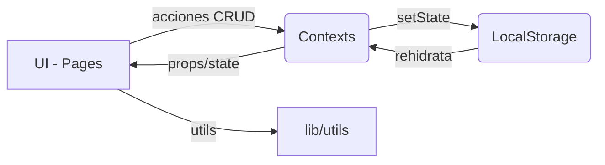

## 💸 Finanzas Personales — Next.js 15, React 19, Tailwind 4


[](https://nextjs.org)
[](https://react.dev)
[](https://www.typescriptlang.org/)
[](https://tailwindcss.com/)
[](https://vercel.com/new/clone?repository-url=https://github.com/IS03/FinanzaPersonal)

Aplicación para gestión personal de finanzas: gastos, ingresos, tarjetas de crédito, cuotas y deudas. Persistencia en `localStorage`. UI con shadcn/ui.

### 📚 Tabla de contenido
- [Características](#-características)
- [Stack](#-stack)
- [Requisitos](#-requisitos)
- [Scripts](#-scripts)
- [Arquitectura](#-arquitectura)
- [UX/UI](#-uxui)
- [Lógica de cuotas](#-lógica-de-cuotas-reglas)
- [Desarrollo local](#-desarrollo-local)
- [Despliegue](#-despliegue)
- [Diagrama](#-diagrama)
- [Capturas](#-capturas)
- [Roadmap](#-roadmap)
- [Limitaciones](#-limitaciones-conocidas)

---

### ✅ Características
- 🧾 Registro y edición de gastos por categoría y medio de pago.
- 💳 Gestión de tarjetas (límite, cierre, vencimiento, saldos usados/disponibles).
- 📅 Cálculo automático de cuotas según reglas de tarjeta; marca de pago por cuota.
- 💼 Ingresos por fuente con filtro mensual.
- 🤝 Deudas por cobrar/pagar; pagos totales o parciales con historial.
- 🗂 Categorías con emoji y seed inicial.
- 💾 Persistencia local rápida con `localStorage`.

### 🧰 Stack
- Next.js 15 (App Router) + React 19 + TypeScript
- Tailwind CSS 4
- shadcn/ui (Radix)
- Iconos: `lucide-react`

### 🖥️ Requisitos
- Node.js 20 o 22
- npm (o pnpm/yarn)

### 🏃 Scripts
- `npm run dev`: servidor dev (http://localhost:3000)
- `npm run build`: build de producción
- `npm start`: servir build

---

## 🧱 Arquitectura

### 🗃️ Estructura de carpetas (relevante)
- `src/app/layout.tsx`: layout global; provee `TarjetasProvider` y `CategoriasProvider`, y renderiza `MainNav`.
- `src/app/page.tsx`: dashboard “Resumen Financiero”.
- `src/app/gastos/page.tsx`: CRUD de gastos + diálogo de alta/edición.
- `src/app/ingresos/page.tsx`: alta y listado de ingresos.
- `src/app/tarjetas/page.tsx`: gestión de tarjetas de crédito.
- `src/app/cuotas/page.tsx`: cálculo y seguimiento de cuotas por tarjeta y por mes.
- `src/app/deudas/page.tsx`: deudas por cobrar/pagar, pagos totales y parciales.
- `src/app/categorias/page.tsx`: categorías (usa `CategoriasProvider`).
- `src/app/context/TarjetasContext.tsx`: estado de tarjetas y actualización de saldos.
- `src/app/context/CategoriasContext.tsx`: estado de categorías (seed inicial).
- `src/app/types/types.ts`: tipado de dominio (Gasto, Ingreso, Tarjeta, Deuda, etc).
- `src/components/ui/*`: componentes shadcn/ui (button, card, table, dialog, select, tabs...).
- `src/components/ui/nav.tsx`: navegación principal con resaltado por ruta.
- `src/lib/utils.ts`: helpers (`formatCurrency`, `formatDate`, `calculateMonthlyStats`, `cn`).

### 🔄 Flujo de datos y persistencia
- Persistencia: `localStorage` por entidad (`gastos`, `ingresos`, `tarjetas`, `categorias`, `deudas`).
- Providers:
  - `TarjetasProvider`: guarda/lee `tarjetas`. Expone `actualizarSaldosTarjetas(gastos)` que recalcula `saldoUsado` y `saldoDisponible` a partir de gastos con `tarjetaId`.
  - `CategoriasProvider`: inicializa categorías por defecto si no hay datos guardados.
- Derivados:
  - Resumen (`/`): filtra `gastos` por mes/año y calcula métricas; muestra “Cuotas Pendientes” calculando vencimientos según `diaCierre`/`diaVencimiento` de cada tarjeta.
  - Cuotas (`/cuotas`): genera cuotas por gasto en crédito, con fechas de vencimiento basadas en reglas de cierre/vencimiento y permite marcar “pagada”.
  - Gastos (`/gastos`): CRUD; si el medio de pago es `credito`, puede asociar `tarjetaId` y `cuotas`.
  - Ingresos (`/ingresos`): alta y listado con filtro por mes.
  - Deudas (`/deudas`): alta, edición, eliminación; pagos totales y parciales con historial; estados `pendiente`/`parcial`/`pagada`.

### 🧾 Modelos de dominio (resumen)
- `Tarjeta`: `id`, `nombre`, `banco`, `limite`, `diaCierre`, `diaVencimiento`, `saldoUsado`, `saldoDisponible`.
- `Gasto`: `id`, `descripcion`, `monto`, `categoriaId`, `medioPago`, `fecha`, opcionales `cuotas`, `cuotasPagadas`, `tarjetaId`, `estado`.
- `Ingreso`: `id`, `descripcion`, `monto`, `fecha`, `fuente`.
- `Deuda`: `id`, `descripcion`, `monto`, `montoPagado`, `tipo`, `persona`, `fecha`, `estado`, opcionales `fechaVencimiento`, `notas`, `historialPagos[]`.

---

## 🎨 UX/UI

### ✨ Principios
- Navegación clara con `MainNav` y estado activo por ruta.
- Formularios simples; validación mínima en cliente.
- Feedback inmediato: listas se actualizan tras crear/editar/eliminar (y se persisten).
- Formato moneda local con `formatCurrency` (es-AR, ARS); fechas legibles con `formatDate`.

### 🧠 Patrones de interacción
- Diálogos modales para altas/ediciones (`Dialog`).
- Listas en `Table` con acciones por fila (editar/eliminar).
- Selectores de mes/año en Resumen y Cuotas.
- Estados visuales:
  - Cuotas: badge “Pagada/Pendiente”.
  - Deudas: totales, pagado, pendiente y detalle de historial.

### ♿ Accesibilidad
- Uso de `label` para inputs clave.
- Controles con foco visible (shadcn + Tailwind).
- Texto suficiente contraste en métricas claves (rojo/orange/green).

### 🪄 Contenido inicial
- `CategoriasProvider` crea categorías por defecto si no hay datos.
- `TarjetasPage` puede inicializar dos tarjetas ejemplo si no existen.

---

## 📐 Lógica de cuotas (reglas)
- Para gastos con `medioPago='credito'` y `cuotas > 0`:
  - Se calcula primera cuota según `diaCierre` y `diaVencimiento` de la `Tarjeta`.
  - Si la compra fue después del `diaCierre`, la primera cuota vence el mes siguiente.
  - Cada cuota fija su vencimiento en `diaVencimiento`.
- En `/cuotas`:
  - Vista “Cuotas del Mes”: agrupa por tarjeta y calcula “Pendiente”.
  - Vista “Próximas Cuotas”: lista futura ordenada por fecha.
  - Acción “Marcar como Pagada” incrementa `cuotasPagadas` en el `Gasto`.

---

## 🧪 Desarrollo local

### ⚙️ Instalar y ejecutar
```bash
npm install
npm run dev
# http://localhost:3000
```

### 🧩 Formato y estilo
- Tailwind 4.
- Componentes reutilizables de shadcn/ui (`src/components/ui/*`).
- Helpers de clase con `cn`.

---

## 🚀 Despliegue

### Vercel (recomendado)
- Importar repo desde GitHub.
- Configuración por defecto:
  - Framework: Next.js
  - Node: 20 o 22
  - Install: `npm install`
  - Build: `next build`
  - Output: `.next`
- Producción desde rama `main`. Cada `git push` redeploya.

---

## 🗺️ Roadmap (sugerencias)
- Persistencia en backend (API/DB) en lugar de `localStorage`.
- Autenticación y multiusuario.
- Categorización inteligente de gastos; reports/exports (CSV).
- Tests unitarios/E2E.
- Internacionalización (moneda/locale configurables).

## ⚠️ Limitaciones conocidas
- No hay validaciones avanzadas ni manejo de timezones complejos.
- Sin control de concurrencia ni sync entre dispositivos (localStorage).
- Sin roles/usuarios.

---

## 🧭 Diagrama



---

## 🖼️ Capturas

> Agrega aquí screenshots o GIFs breves de las vistas principales (Resumen, Gastos, Tarjetas, Cuotas, Deudas) para facilitar onboarding.

